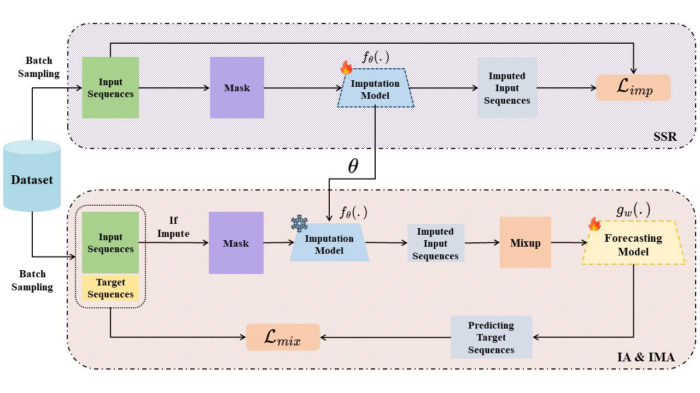

# IMA: An Imputation-based Mixup Augmentation Using Self-Supervised Learning for Time Series Data

## Introduction

Data augmentation plays a crucial role in enhancing model performance across various AI fields by introducing variability while maintaining the underlying temporal patterns. However, in the context of long sequence time series data, where maintaining temporal consistency is critical, there are fewer augmentation strategies compared to fields such as image or text, with advanced techniques like Mixup rarely being used. In this work, we propose a novel approach, Imputation-based Mixup Augmentation (IMA), which combines Imputed-data Augmentation with Mixup Augmentation to bolster model generalization and improve forecasting performance. We evaluate the effectiveness of this method across several forecasting models, including DLinear (MLP), TimesNet (CNN), and iTrainformer (Transformer), these models represent some of the most recent advances in long sequence time series forecasting. Our experiments, conducted on three datasets (ETT-small, Illness, Exchange Rate) from various domains and compared against eight other augmentation techniques, demonstrate that IMA consistently enhances performance, achieving 22 improvements out of 24 instances, with 10 of those being the best performances, particularly with iTrainformer imputation in ETT dataset.



## Set Up the Environment

You can choose either Conda or venv to create and manage the Python environment.

### Option 1: Using Conda

1. Create the environment

```
conda create -n ts_ND python=3.8

```

2. Activate the environment

```
conda activate ts_ND

```

### Option 2: Using venv

1. Create the environment:

```
python3 -m venv ts_ND

```

2. Activate the environment:

- On Linux/macOS:

```
source ts_ND/bin/activate
```

- On Windows:

```
ts_ND\Scripts\activate
```

### Install necessary packaged

After activating the environment, install the required packages:

```
pip install -r requirements.txt
```

## Data

You can download ETT, Illness, Exchange Rate dataset run for this paper or another well pre-processed time series datasets at this resource [Google Drive](https://drive.google.com/drive/folders/13Cg1KYOlzM5C7K8gK8NfC-F3EYxkM3D2)

## Train your task

We provide the experiment scripts in folder [LTSF_mask/](./scripts/LTSF_mask/). You can based on your purpose to change the hyperparameter in script.

```
# imputation
bash ./scripts/LTSF_mask/dataset/model_mask.sh
# Long-term forecast with Imputation-data Augmentation
bash ./scripts/LTSF_mask/dataset/model_mask_forecast.sh
# Long-term forecast with Imputation-based Mixup Augmentation
```

## Acknowledgement

This work is based on [Time-Series-Library](https://github.com/thuml/Time-Series-Library) reposetory.
